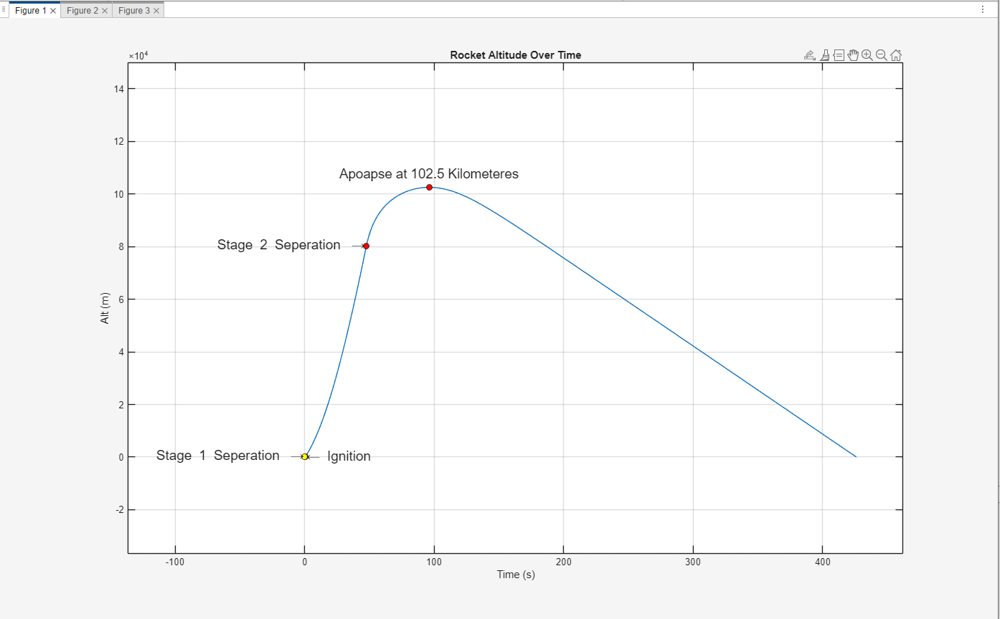
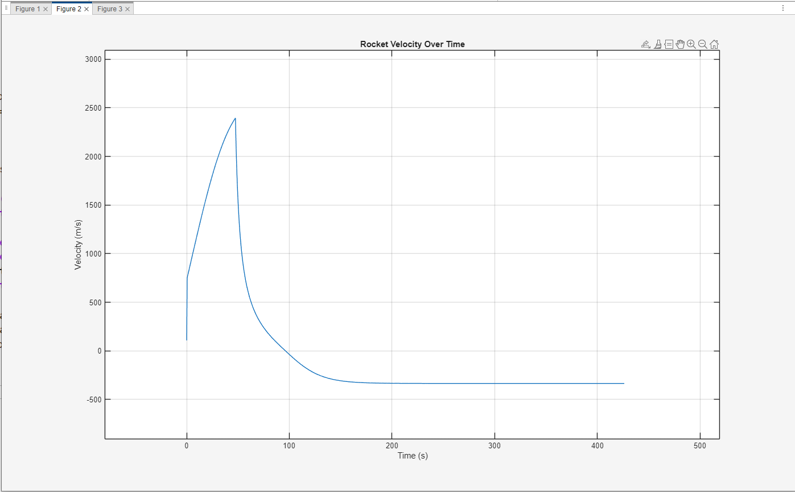
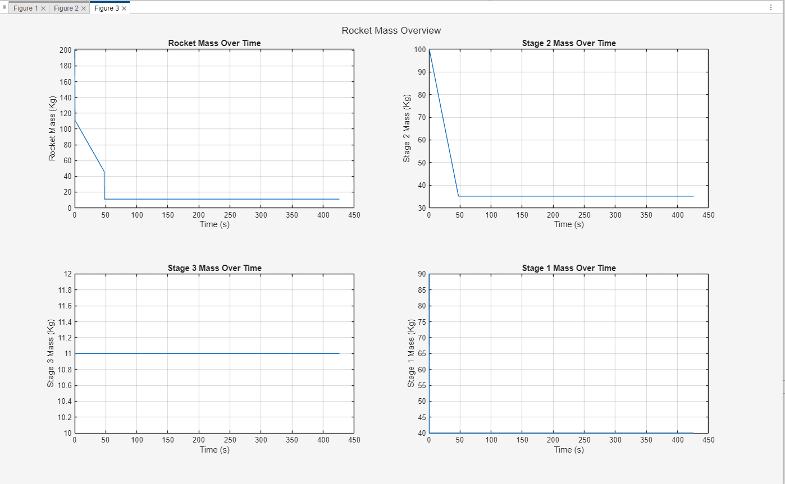

# MATLAB Rocket Simulation

This project simulates a 2-stage rocket launch with realistic physics including mass depletion, stage separation, thrust, gravity, and drag.

---

## How to Run

1. Make sure the following files are in the same folder:
   - `simulateRocket.m`
   - `rocket.m`
   - `stage.m`
2. Open MATLAB and run `simulateRocket.m`.

---

## What It Tracks

- Altitude  
- Velocity  
- Net force  
- Mass of each stage over time  
- Total rocket mass  
- Stage separation points  
- Apoapsis (peak altitude)

---

## Rocket Parameters

### Stage 1
- **Initial Mass**: 100 kg  
- **Thrust**: 220,000 N  
- **Burn Time**: 0.6 s  
- **Mass Flow Rate**: 100 kg/s  

### Stage 2
- **Initial Mass**: 100 kg  
- **Thrust**: 6,700 N  
- **Burn Time**: 47 s  
- **Mass Flow Rate**: 1.38 kg/s  

### Payload
- **Mass**: 11 kg  

### Initial Conditions
- **Position**: 0 m (on ground)  
- **Velocity**: 0 m/s  
- **Drag Coefficient**: 0.02  

---

## Example Graphs

### Altitude Over Time  

### Velocity Over Time  

### Stage & Rocket Mass   

